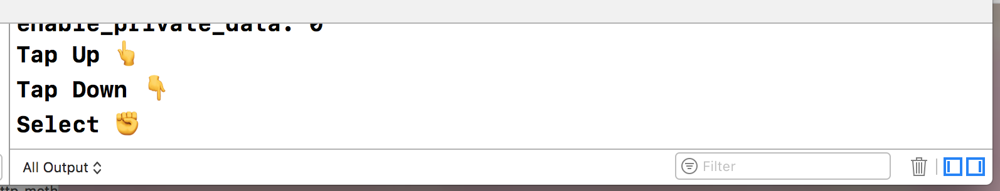
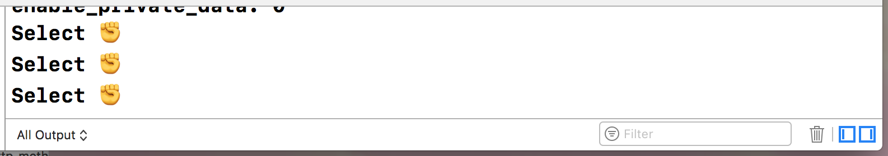

# Remote App does not trigger Tap gestures
Project created to report bug on iOS Remote App

· Open radar: https://openradar.appspot.com/radar?id=5020390241861632

# Description
When using the App Remote for iOS there is not way to trigger Tap gestures. 

Event on devices with 3D Touch tap gestures are triggered as Select to the methods `pressesBegan`, `pressesEnded`, `pressesChanged` and `pressesCancelled`

# Expected 
The methods `pressesBegan`, `pressesEnded`, `pressesChanged` and `pressesCancelled` receive different gesture types for tap and select gestures on the same way than when using Siri Remote.

# Steps

1.- Tap Up, Down and then Select on Siri Remote

2.- Tap Up, Down and then Select on the iOS Remote App

